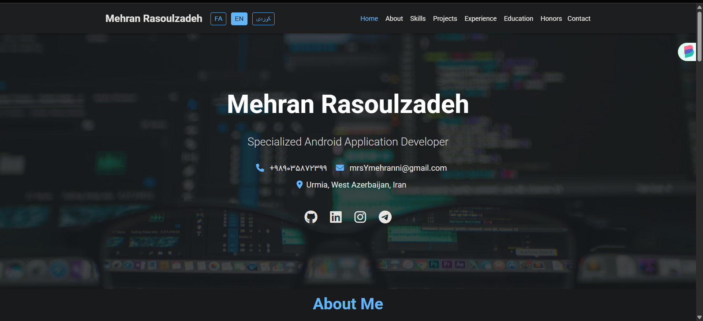

# وب‌سایت رزومه شخصی مهران رسول‌زاده (MehranMr17)

 سلام! 👋 این ریپازیتوری شامل کدهای وب‌سایت شخصی و رزومه آنلاین **مهران رسول‌زاده** است. این وب‌سایت با هدف نمایش مهارت‌ها، پروژه‌های انجام شده و سوابق حرفه‌ای به شکلی جذاب و مدرن طراحی و پیاده‌سازی شده است.

می‌توانید نسخه زنده و نهایی وب‌سایت را در آدرس زیر مشاهده کنید:
**[https://mehranmr17.github.io](https://mehranmr17.github.io/)**

---

## 🖼️ نمایی از وب‌سایت

در اینجا نمایی از صفحه اصلی وب‌سایت را مشاهده می‌کنید:

  

---

## ✨ ویژگی‌های کلیدی

* **طراحی مدرن و واکنش‌گرا (Responsive):** نمایش بهینه در دستگاه‌های مختلف (دسکتاپ، تبلت و موبایل).
* **حالت تاریک (Dark Mode):** برای تجربه کاربری بهتر در محیط‌های کم‌نور.
* **چند زبانه:** پشتیبانی از زبان‌های فارسی (FA)، انگلیسی (EN) و کوردی سورانی (CKB) با قابلیت سوئیچ بین زبان‌ها.
* **بخش‌های جامع:**
    * **مقدمه (Hero Section):** معرفی اولیه و لینک‌های دسترسی سریع.
    * **درباره من (About Me):** خلاصه‌ای از سوابق، اطلاعات فردی و مهارت‌های زبانی.
    * **توانمندی‌ها (Skills):** نمایش مهارت‌های فنی و تخصصی با آیکون‌های جذاب.
    * **پروژه‌های منتخب (Projects):** معرفی پروژه‌های انجام شده با توضیحات و فناوری‌های به‌کار رفته.
    * **سوابق حرفه‌ای (Experience):** نمایش سوابق شغلی و تدریس در قالب تایم‌لاین.
    * **سوابق تحصیلی (Education):** اطلاعات مربوط به تحصیلات.
    * **افتخارات و گواهینامه‌ها (Honors & Certificates):** نمایش دستاوردها و مدارک کسب شده.
    * **ارتباط با من (Contact):** راه‌های ارتباطی و لینک به شبکه‌های اجتماعی.
* **انیمیشن‌های ظریف:** برای ایجاد تجربه بصری دلپذیرتر هنگام اسکرول.
* **کدنویسی خوانا و قابل توسعه:** ساختار منظم HTML، CSS و JavaScript.

---

## 🛠️ فناوری‌های استفاده شده

این وب‌سایت با استفاده از فناوری‌های زیر توسعه داده شده است:

  
  
  
  
  

---

## 🔗 با من در ارتباط باشید

از طریق لینک‌های زیر می‌توانید بیشتر با من و کارهایم آشنا شوید:

* **گیت‌هاب:** [MehranMr17](https://github.com/MehranMr17)
* **لینکدین:** [MehranMr17](www.linkedin.com/in/mehranmr17)

* **وب‌سایت شخصی:** [Resume](https://mehranmr17.github.io)

---

امیدوارم از این پروژه لذت ببرید! اگر پیشنهاد یا بازخوردی داشتید، خوشحال می‌شوم از طریق Issues همین ریپازیتوری یا راه‌های ارتباطی دیگر با من در میان بگذارید.

⭐ فراموش نکنید به پروژه ستاره بدهید! ⭐
